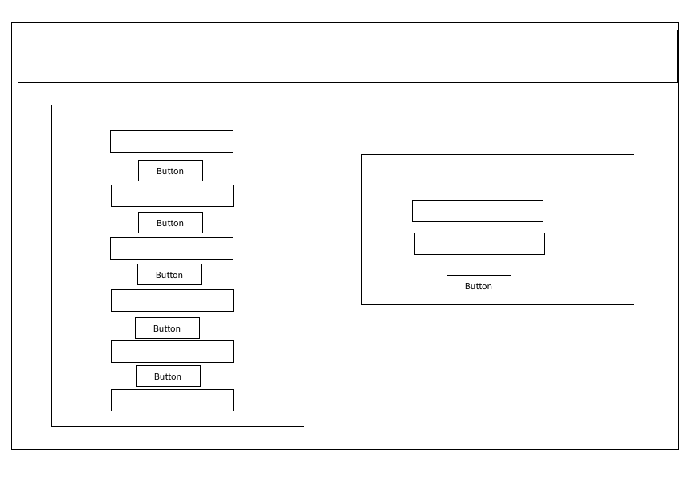

# Joke-for-fun-app

## Technologies Used:
#### Axios 
#### React.js
#### SpringBoot

## API used:
https://official-joke-api.appspot.com/random_ten

## Problem Statement:
If someone if having a cold day this may help uplift thier mood

## Proposition and Target End Users:
Creating an app that lets user read joke and and update joke to share. For anyone who want a big smile.

## Wireframe:

## Link:

